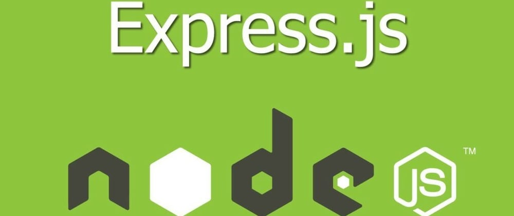
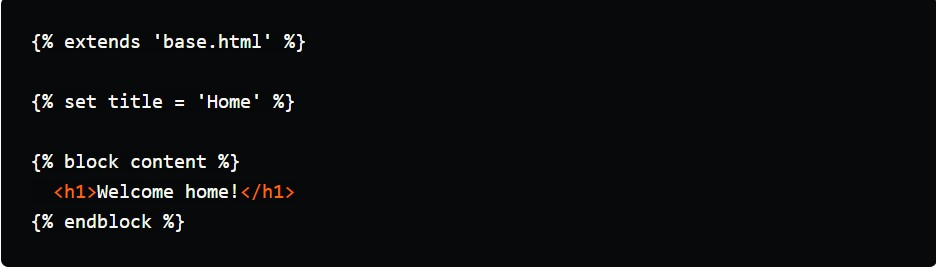

<div class="image-container">
    
</div>

# How to Set Up Nunjucks with ExpressJS

## Introduction
When building a web app without a dedicated front-end framework like ReactJS, Templating engines (e.g. Blade, Nunjucks) are incredibly useful.

Though they aren't entirely necessary, they definitely help create more dynamic pages with cleaner HTML code.

Before getting into JavaScript, Flask and Django were my preferred choices for building web applications. Coming from that background, I got very used to the Jinja2 engine.

When I switched to using Express for web app development, I wanted a solution that would have similar syntax and features to Jinja2. Fortunately, Nunjucks is exactly that. This is a templating engine that is heavily inspired by Jinja2.

In this article, I will walk you through the Nunjucks setup for ExpressJS. This is a fairly simple and straight-forward process.

## Setup
First, create an empty folder. Navigate into the folder and run the following command to initialise npm:

`npm init`

Follow all the prompts to setup your project.

Once the setup process has completed, you should have a package.json file in the root of your project.

## Installing packages
Next, run the following command to install express and nunjucks.

`npm install express nunjucks`

Defining the entry point
Now create the file that will be the entry point of our application. I name this file index.js and place it at the root of my project.

The contents of index.js are as follows:

`const express = require('express')`<br>
`const nunjucks = require('nunjucks')`<br>
`var app = express()`<br>
`nunjucks.configure('views', {`<br>
`autoescape: true,`<br>
`express: app`<br>
`})`

`app.set('view engine', 'html')`<br>
`const PORT = '8000'`<br>
`app.get('/', (req, res) => {`<br>
`res.render('home.html')`<br>
`})`

`app.listen(PORT, () => {`<br>
``console.log(`Listening on port ${PORT}...`)``<br>
`})`

Let's take a moment to go through what's happening in this file:

* Require the express and nunjucks packages.
* Create an instance of express and assign it to a variable called 'app'.
* Configuring nunjucks: The first parameter is the path to the template folder. The second parameter is an object containing configuration options. Autoescape makes sure all output to templates are escaped before display (recommended). You can manually mark the output as safe. The express property requires an instance of an express app.
* Set the port number. We'll use this when starting the application later.
* Create a 'get' route at '/' and return a response that simply renders the template home.html.
* Listen for connections on the specified port.

## Creating the templates
At the moment if you try to load the application, you'll get an error because we haven't created the template that we're trying to render yet.
Remember that we set the path to templates as 'views'. Nunjucks will look for the 'views' folder in the same directory as the script that runs the configuration.
If you have your template folder in another directory or have named it something different like 'templates', make sure you configure the path correctly.

In this case, we have to create a folder called 'views' in the root of our project (because this is where index.js resides).
Inside the views folder, create a base.html template. This is the template that will be inherited by other templates. It allows us to define certain UI elements, styles and scripts only once and have them displayed/imported on every template.
This is where we'd define navigation bars and page footers.

The contents of base.html are as follows:

```
<!DOCTYPE html>
<html>
  <head>
    <meta charset="utf-8">
    <meta http-equiv="X-UA-Compatible" content="IE=edge">
    <title>{{ title }}</title>
    <meta name="description" content="">
    <meta name="viewport" content="width=device-width, initial-scale=1">
    <link rel="stylesheet" href="">
  </head>
  <body>
    
    <script src="" async defer></script>
  </body>
</html>

```

We've defined a content block that will be overridden by the child templates. This is where the child templates will 
place their respective content.

Next, create a home.html template that extends base.html and displays a simple header in the content block.

<div class="image-container">
    
</div>

Now that we've created the templates, we're able to load the home page. Visit localhost at the specified port and you 
should see that your app is up and running!
